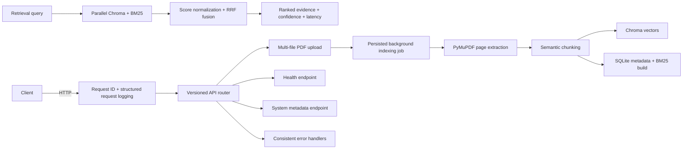

# Milestone 3 Architecture

## Scope

Milestone 3 adds evidence-only hybrid retrieval. It intentionally does not implement reranking, LangGraph query planning, query rewriting, answer generation, citation verification, or RAG evaluation.

## Runtime flow

## Local development

1. Optionally copy `.env.example` to `.env` to override defaults (the container also runs with safe defaults).
2. Create an isolated Python environment using Python 3.11–3.13.
3. Install development packages with `pip install -e '.[dev]'`.
4. Run `uvicorn backend.app.main:app --reload`.
5. Run `pytest` to verify the API foundation.

## Container development

Run `docker compose -f docker/docker-compose.yml up --build`. The container runs as a non-root user and publishes port 8000. Its liveness check calls `/api/v1/health`.

## Configuration

`backend.app.core.config.Settings` reads environment variables and an optional root `.env` file. Do not commit `.env`; use `.env.example` as the reference. Chroma, SQLite, upload storage, chunking, and BGE model configuration are local-only.

## Retrieval boundaries

`HybridRetrievalEngine` is an evidence-only application service. It delegates semantic search to ChromaDB, lexical search to `rank_bm25`, and executes both in parallel using a bounded thread pool. Reciprocal Rank Fusion removes duplicate chunk IDs and combines rankings without assuming semantic distances and BM25 scores share a scale. Query rewriting, LangGraph orchestration, generation, reranking, and citation verification remain later milestones.
