# Milestone 7 Architecture

## Scope

Milestone 7 adds independent citation and grounding verification downstream of generation. It intentionally does not implement streaming, frontend behavior, or RAG evaluation.

## Runtime flow

```mermaid
flowchart LR
    Client -->|HTTP| Middleware[Request ID + structured request logging]
    Middleware --> Router[Versioned API router]
    Router --> Upload[Multi-file PDF upload]
    Upload --> Job[Persisted background indexing job]
    Job --> Parser[PyMuPDF page extraction]
    Parser --> Chunking[Semantic chunking]
    Chunking --> Chroma[Chroma vectors]
    Chunking --> SQLite[SQLite metadata + BM25 build]
    Search[Retrieval query] --> Parallel[Parallel Chroma + BM25]
    Parallel --> RRF[Score normalization + RRF fusion]
    RRF --> Evidence[Ranked evidence + confidence + latency]
    Evidence --> Rerank[Cross-encoder batch reranking]
    Rerank --> FinalEvidence[Reranked evidence + preserved scores]
    FinalEvidence --> Confidence[Evaluate confidence]
    Confidence -->|threshold met| Return[Return evidence]
    Confidence -->|weak and retries remain| Rewrite[Deterministic rewrite]
    Rewrite --> Retry[Retry node]
    Retry --> Parallel
    Confidence -->|budget exhausted| Insufficient[Insufficient evidence]
    Return --> Prompt[Versioned evidence-only prompt]
    Prompt --> Ollama[Local Ollama / Qwen2.5]
    Ollama --> Guard[Citation-format + hallucination guard]
    Guard --> Answer[Grounded answer + coverage + confidence]
    Answer --> Claims[Atomic claim extraction]
    Claims --> CitationParse[Citation parsing]
    CitationParse --> Support[Claim-to-evidence semantic support]
    Support --> Verified[Verified answer + report]
    Support -->|unsupported and retries remain| Targeted[Targeted retrieval repair]
    Targeted --> Prompt
    Router --> Health[Health endpoint]
    Router --> System[System metadata endpoint]
    Router --> Errors[Consistent error handlers]
```

## Local development

1. Optionally copy `.env.example` to `.env` to override defaults (the container also runs with safe defaults).
2. Create an isolated Python environment using Python 3.11–3.13.
3. Install development packages with `pip install -e '.[dev]'`.
4. Run `uvicorn backend.app.main:app --reload`.
5. Run `pytest` to verify the API foundation.

## Container development

Run `docker compose -f docker/docker-compose.yml up --build`. The container runs as a non-root user and publishes port 8000. Its liveness check calls `/api/v1/health`.

## Configuration

`backend.app.core.config.Settings` reads environment variables and an optional root `.env` file. Do not commit `.env`; use `.env.example` as the reference. Chroma, SQLite, upload storage, chunking, and BGE model configuration are local-only.

## Retrieval boundaries

`HybridRetrievalEngine` is an evidence-only application service. It delegates semantic search to ChromaDB, lexical search to `rank_bm25`, and executes both in parallel using a bounded thread pool. Reciprocal Rank Fusion removes duplicate chunk IDs and combines rankings without assuming semantic distances and BM25 scores share a scale. Query rewriting, LangGraph orchestration, generation, and citation verification remain later milestones; reranking is applied separately by `RerankingService`.

## Reranking boundaries

`RerankingService` accepts a `HybridRetrievalResult`, forms `(original_query, chunk_text)` pairs, and invokes the cached local cross-encoder in one batched call. It sorts only by cross-encoder relevance, preserves the complete hybrid candidate object, and reports a sigmoid-normalized score, confidence, and model latency. The model adapter is lazy and lock-protected so application startup never downloads model weights and concurrent first requests cannot load duplicate models.

## LangGraph nodes

- `hybrid_retrieval`: executes the existing parallel semantic/BM25 engine for the current query.
- `cross_encoder_reranking`: reranks the hybrid candidates with the original/current query.
- `evaluate_confidence`: combines reranker confidence, source agreement, and evidence coverage.
- `rewrite_query`: applies deterministic evidence-oriented terms without calling an LLM; repeated queries are blocked.
- `retry_retrieval`: records the bounded retry transition before returning to hybrid retrieval.
- Conditional edges return evidence when the threshold is met, or return `insufficient_evidence` after the retry budget is exhausted.

The typed `AgentState` carries the current query, attempt number, filters, results, confidence, seen-query set, trace, and reasoning steps. Every node emits a timestamped structured trace event and a structured log entry.

## Grounded generation decisions

- Only an agent state with `status=evidence` and non-empty reranked candidates reaches the provider.
- `ContextWindowManager` keeps ranked evidence order, preserves document/page/chunk provenance, and clips the final passage to a configured character budget.
- `GroundedPromptBuilder` is versioned and explicitly forbids outside knowledge, uncited factual claims, invented citation numbers, and hidden-instruction disclosure.
- The Ollama adapter uses `stream=false`, temperature zero, and a bounded output budget. Its provider port is stateless and batch-friendly, leaving streaming as a future adapter capability.
- The hallucination guard rejects empty output, unsupported citation indexes, missing citations, and the model's ungrounded answer format. Claim entailment is performed downstream by the independent verification module.

## Citation verification decisions

- `AtomicClaimExtractor` uses deterministic sentence, semicolon, and line boundaries while retaining each claim's original citation markers.
- `CitationParser` audits every numeric marker, including unknown markers, before semantic scoring.
- `SemanticSupportVerifier` sends `(claim, cited passage)` pairs through the existing local cross-encoder and requires every cited passage for a claim to meet the configured normalized support threshold.
- Coverage is the supported-claim fraction; grounding combines claim coverage and valid-citation fraction. Unsupported claims and unknown citation IDs are never silently treated as supported.
- The verification endpoint injects targeted retry and regeneration callbacks. After the retry budget, only supported claims may remain; if configured minimum coverage is not met, the final answer is `Insufficient evidence.`
