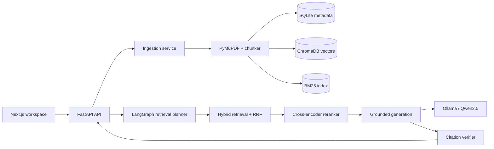
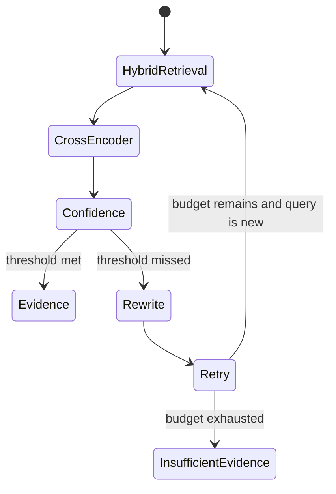
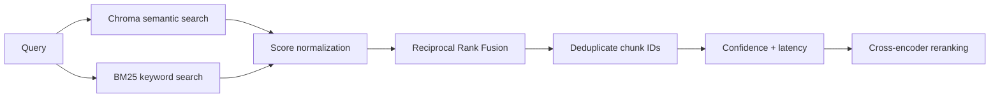
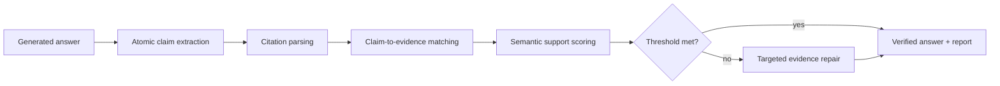
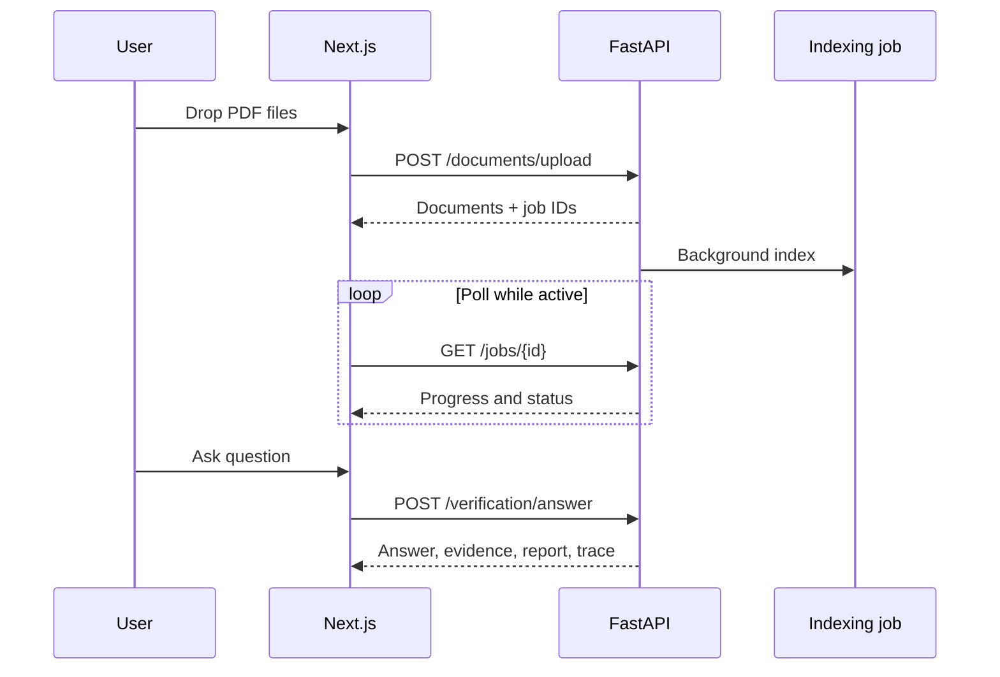

# Architecture diagrams

## Overall system

```mermaid
flowchart LR
  UI[Next.js workspace] --> API[FastAPI API]
  API --> ING[Ingestion service]
  ING --> PDF[PyMuPDF + chunker]
  PDF --> STORE[(SQLite metadata)]
  PDF --> VEC[(ChromaDB vectors)]
  PDF --> BM[(BM25 index)]
  API --> AGENT[LangGraph retrieval planner]
  AGENT --> HYB[Hybrid retrieval + RRF]
  HYB --> RERANK[Cross-encoder reranker]
  RERANK --> GEN[Grounded generation]
  GEN --> OLLAMA[Ollama / Qwen2.5]
  GEN --> VERIFY[Citation verifier]
  VERIFY --> API
```

## Agent workflow

```mermaid
stateDiagram-v2
  [*] --> HybridRetrieval
  HybridRetrieval --> CrossEncoder
  CrossEncoder --> Confidence
  Confidence --> Evidence: threshold met
  Confidence --> Rewrite: threshold missed
  Rewrite --> Retry
  Retry --> HybridRetrieval: budget remains and query is new
  Retry --> InsufficientEvidence: budget exhausted
```

## Retrieval pipeline

```mermaid
flowchart LR
  Q[Query] --> S[Chroma semantic search]
  Q --> K[BM25 keyword search]
  S --> N[Score normalization]
  K --> N
  N --> RRF[Reciprocal Rank Fusion]
  RRF --> D[Deduplicate chunk IDs]
  D --> C[Confidence + latency]
  C --> X[Cross-encoder reranking]
```

## Verification pipeline

```mermaid
flowchart LR
  A[Generated answer] --> C[Atomic claim extraction]
  C --> P[Citation parsing]
  P --> M[Claim-to-evidence matching]
  M --> S[Semantic support scoring]
  S --> D{Threshold met?}
  D -->|yes| V[Verified answer + report]
  D -->|no| R[Targeted evidence repair]
  R --> V
```

## Frontend/backend interaction

```mermaid
sequenceDiagram
  participant U as User
  participant F as Next.js
  participant B as FastAPI
  participant J as Indexing job
  U->>F: Drop PDF files
  F->>B: POST /documents/upload
  B-->>F: Documents + job IDs
  B->>J: Background index
  loop Poll while active
    F->>B: GET /jobs/{id}
    B-->>F: Progress and status
  end
  U->>F: Ask question
  F->>B: POST /verification/answer
  B-->>F: Answer, evidence, report, trace
```
